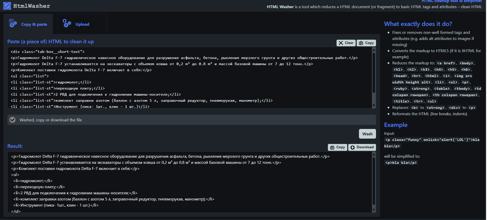

# FilterHTMLTagsClipboard_Python_XSLT_Java_AHK #

    What exactly does it do?
    Fixes or removes non-well formed tags and attributes (e.g. adds alt attributes to images if missing)
    Converts the markup to HTML5 (if it is XHTML for example)
    Reduces the markup to: <a href>, <body>, <h1>, <h2>, <h3>, <h4>, <h5>, <h6>, <head>, 
, <html>, <i>, , <li>, <ol>, 
, <ruby>, <strong>, <table>, <tbody>, <td colspan rowspan>, <th colspan rowspan>, <title>, <tr>, <ul>
    Replaces: <b> to <strong>, 
 to 

    Reformats the HTML (line breaks, indents)
    Example
    Input:
    
bla bla

    
    will be simplified to:
    
bla bla

    

Inspired by **HTML Washer**

https://www.htmlwasher.com/

HTML Washer is a tool which reduces a HTML document (or fragment) to basic HTML tags and attributes – clean HTML

## What's the gist? ##
The difference from HTML Washer is that we operate locally using clipboard(copy and paste functionality of Windows). 
- This programm makes your work 10 times faster and 
- more secure because you don't need to open third party Internet services.

